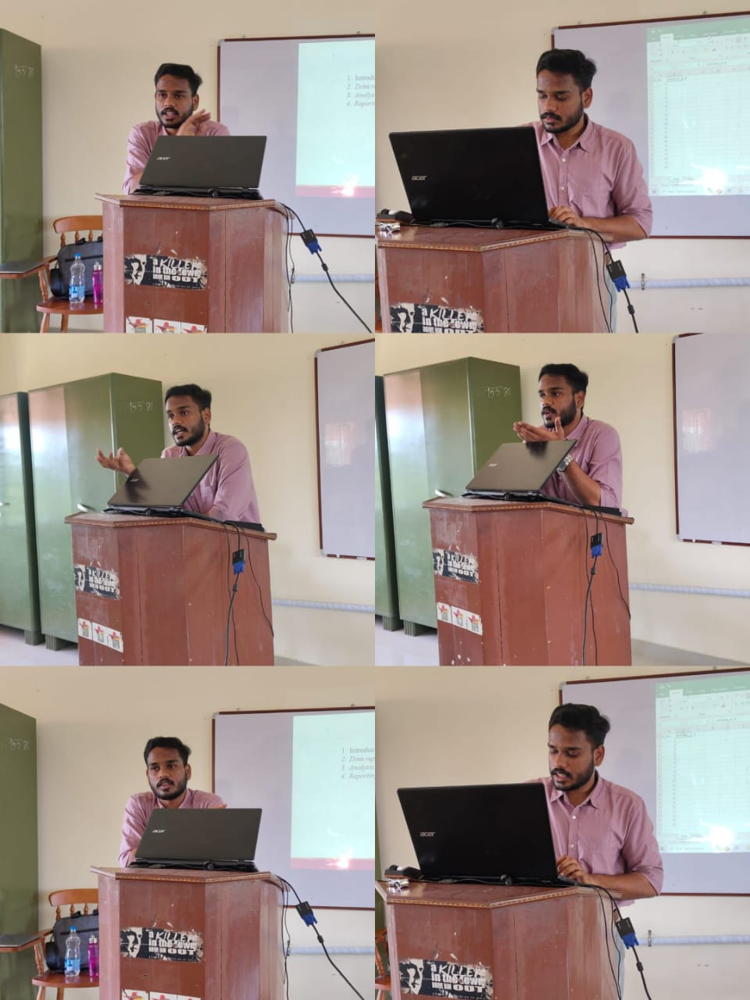
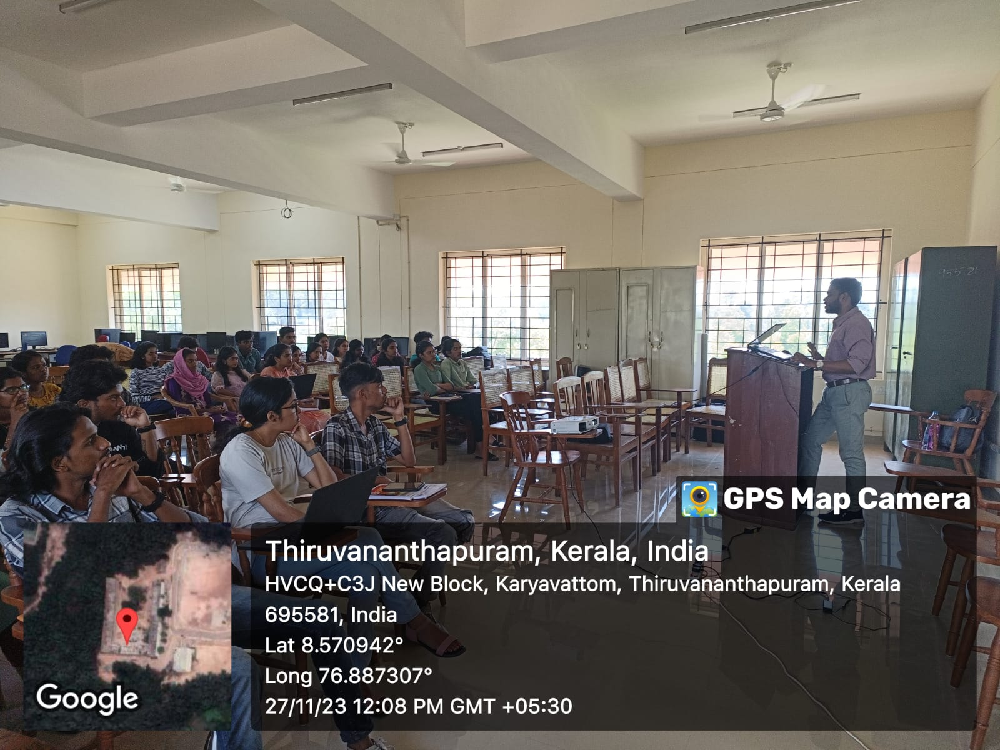

In my fifth semester of bachelor's, the inclusion of a subject called R software posed a challenge for the entire class. Recognizing the struggles, two friends and I took the initiative to grasp the fundamental aspects of R software independently. We not only mastered it ourselves but also shared our knowledge with the entire class, preparing everyone for the practical exam scheduled in the final semester.

As we progressed to the final semester, our degree project introduced us to SPSS, a software unfamiliar to us. Navigating through the interface, understanding data management, and learning the intricacies of data formatting and cleaning were daunting tasks. This recurring issue had persisted for years, leaving students unequipped for their projects.

Motivated by the experience gained during my Master's research consultation, I saw an opportunity to address this gap. I approached my faculty seeking permission to conduct a *One Day Workshop on Introduction to SPSS*. To my delight, she promptly granted approval, acknowledging the potential benefits for final-year students and their project work. This initiative aimed to empower students with essential SPSS skills, providing them with a foundation for successful completion of their degree projects.

Conveying my knowledge to students, spanning from third-year to first-year B.Sc. Statistics, was a truly rewarding experience. During the workshop, I provided hands-on training in utilizing SPSS for data manipulation, cleaning, and basic data analysis, covering descriptive analysis and introductory inferential statistics.

The feedback I received from the students was incredibly heartening. They not only appreciated the workshop but also expressed a keen interest in having more sessions in the future. Their enthusiasm and positive responses affirmed the impact of the class and motivated me to consider additional opportunities to share knowledge with them.

