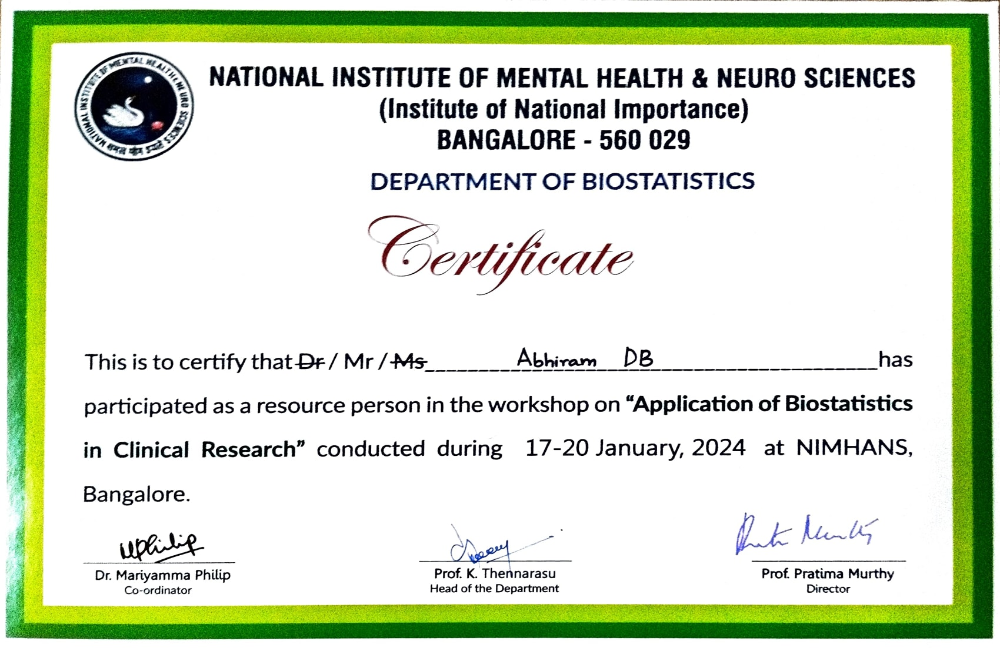

## Application of Biostatistics in Clinical Research (ABCR)

I take immense pride in transitioning from a participant in the ABCR 2023 workshop to now being a resource person for a national workshop in my department, focused on imparting statistical knowledge to medical professionals.

My role in organizing the 2023 ABCR workshop presented numerous challenges, from coordinating with team members to managing logistics for a national event. The experience not only tested my organizational skills but also provided invaluable lessons in teamwork and effective workshop execution.

Fast forward to the 2024 ABCR workshop, where I had the privilege of teaching statistical methods using the IBM SPSS software to approximately 40 delegates. The positive feedback and appreciation received from the delegates not only made me elated but also boosted my confidence. This journey, from workshop organization to becoming an instructor, has been incredibly rewarding, reinforcing my commitment to contributing to the growth and understanding of statistical methodologies within the medical community.

