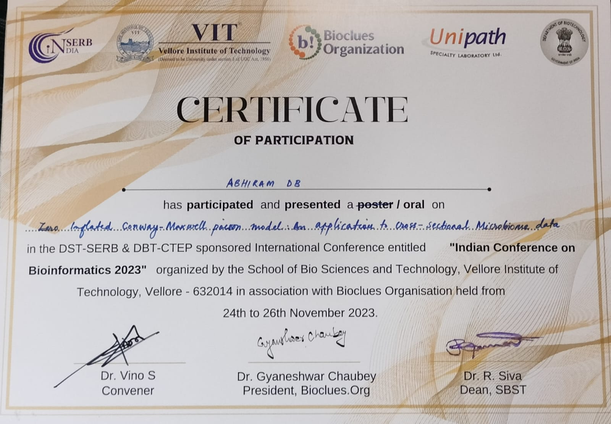
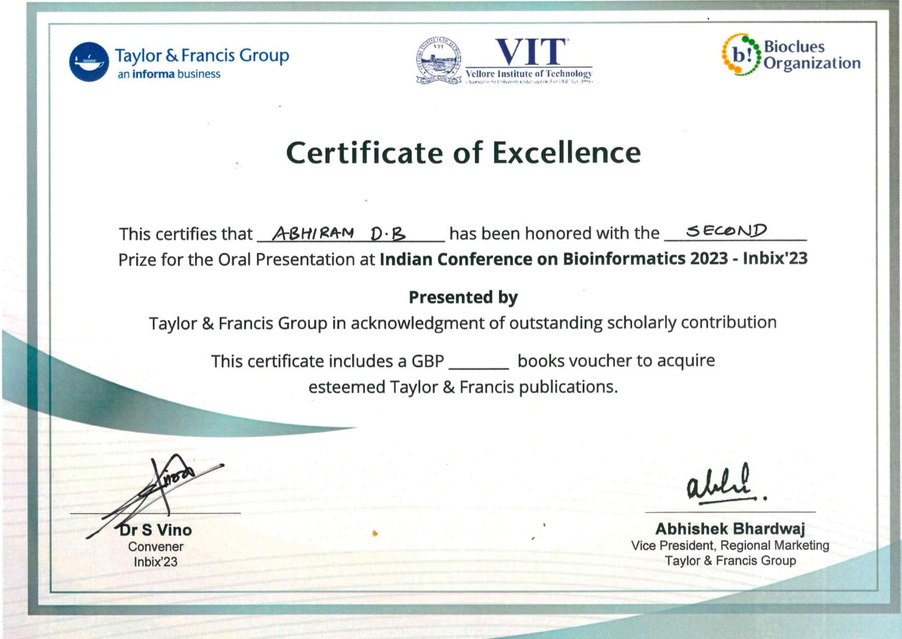
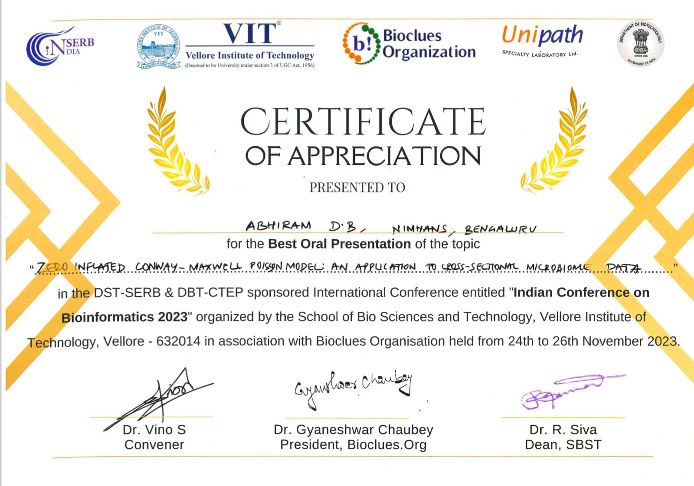

## Inbix'23 Conference
Gratitude to Bioclues Organization and [**VIT Vellore**](https://vit.ac.in/school-bio-sciences-technology-sbst/indian-conference-bioinformatics-2023-inbix23) for Orchestrating an Enriching National Conference in Bioinformatics. A Heartfelt Appreciation for the Gathering of Eminent Minds from Across India. The experience was a tapestry of insightful talks and meaningful interactions. Special Thanks to the [**Taylor & Francis Group**](https://www.tandfonline.com/) for their Sponsorship, Elevating the Workshop to Remarkable Success.

## Oral Presentation
Presenting the First Objective of My Dissertation: An Interactive Session with Esteemed Professors in Biosinformatics. Delving into Microbiome (Count) Data, I Sought Valuable Insights from Seasoned Researchers to Enhance the Applicability of My Work. Their Input Guided a Comparative Analysis between Zero-Inflated Negative Binomial and Zero-Inflated Conway-Maxwell-Poisson Models for Cross-Sectional Data. The Results Highlighted the Superior Performance of ZICMP in Handling Overdispersed, Sparse Count Data. The Positive Reception at the Conference Encourages Swift Publication to Benefit Fellow Researchers.

## Second Prize & Best Oral Presentation
Expressing heartfelt gratitude for being awarded the second prize in my presentation. It's a tremendous honor to receive the Best Oral Presenter Award and deeply appreciate the recognition from [**Taylor & Francis Group**](https://www.tandfonline.com/). The voucher claim adds to the acknowledgment, and I'm honored to be part of the distinguished winners of the scientific forum.

